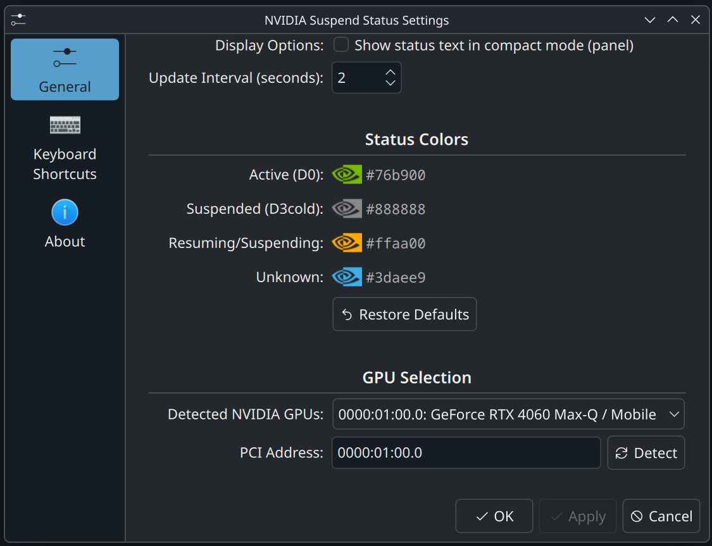

# NVIDIA Suspend Status


A KDE Plasma 6 widget to monitor your NVIDIA dGPU power state at a glance.

## Features
- **Real-time status**: Shows whether the GPU is `Active (D0)` or `Suspended (D3cold)`.
- **Lightweight**: Uses standard Linux `sysfs` to check power state, no heavy `nvidia-smi` polling required.
- **Configurable**: Manually set your GPU's PCI address if needed.
- **Plasma 6 Ready**: Built for the latest KDE environment.

## Requirements
- **Hardware**: NVIDIA GPU with support for power management (RTD3).
- **Software**: 
  - KDE Plasma 6
  - NVIDIA proprietary driver (with `NVreg_DynamicPowerManagement=0x02` enabled for most laptops)
  - `kpackagetool6` (for installation)

## Installation

### From Source
1. Clone the repository:
   ```bash
   git clone https://github.com/UserCel/nvidia-suspend-status.git
   ```
2. Install the widget:
   ```bash
   kpackagetool6 -t Plasma/Applet -i package/
   ```
3. Restart Plasma or use the widget Browser to add **NVIDIA Suspend Status** to your panel or desktop.

## Configuration
The widget needs to know the PCI address of your GPU to monitor its power state.
1. Right-click the widget and select **Configure NVIDIA Suspend Status...**.
2. Go to the **General** tab.
3. Your GPU should be **automatically detected** in the dropdown list.
4. If not, click **Detect** or manually enter the PCI address (e.g., `0000:01:00.0`).
5. Set your preferred **Update Interval** and **Status Colors**.
6. Click **OK**.

## License
Distributed under the **GPL-3.0-or-later** License. See `LICENSE` for more information.
