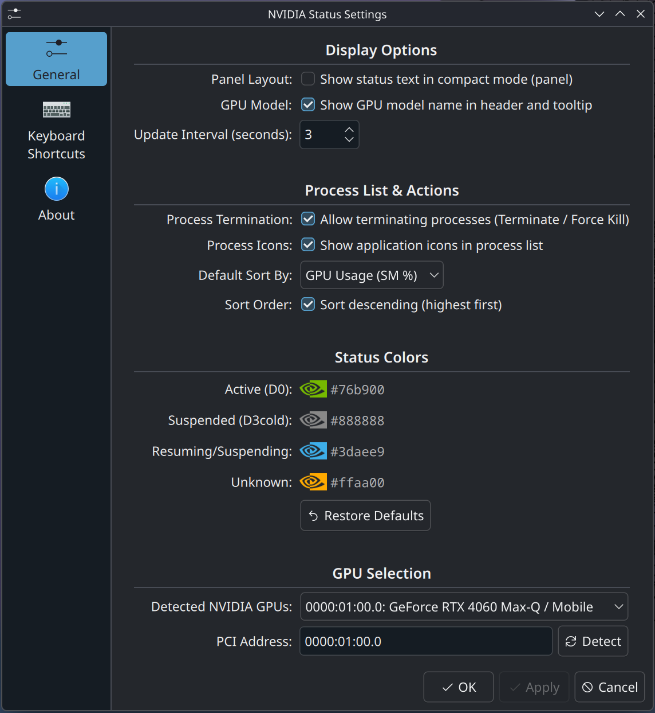
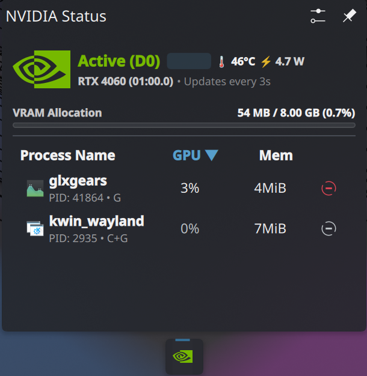

# NVIDIA Status



KDE Plasma 6 widget for monitoring NVIDIA GPU power state (`Suspended / D3cold` vs `Active / D0`) and active processes.

## Features
- **GPU Status Monitor**: Real-time monitoring of `Suspended (D3cold)` and `Active (D0)` power states via sysfs.
- **Process Tracking**: Lists applications using the dGPU with GPU utilization (%) and VRAM memory consumption.
- **Flexible Display Modes**: Use as a compact panel applet or place directly on your desktop / secondary monitor as a floating widget.
- **Configurable Process Sorting**: Sort processes by GPU Usage (SM %), VRAM allocation, or Process Name with ascending/descending toggles.
- **Smart Power Guardian**: Automatically pauses polling when user applications close, allowing the dGPU to enter `D3cold` sleep state even while keeping the process list view open. Filters out background desktop compositor tasks (`kwin_wayland`, `plasmashell`).
- **GPU Telemetry & VRAM Meter**: Visual progress bar for total dGPU VRAM allocation along with live temperature (°C) and power draw (Watts) telemetry.
- **Process Management**: Directly terminate (`SIGTERM`) or force kill (`SIGKILL`) user applications keeping the dGPU awake (with safe protection for system processes like `kwin_wayland` and a settings toggle to enable/disable).
- **Process Icon Resolution**: Automatically resolves desktop icons for apps, games, tools, and system processes running on the dGPU (configurable in settings).
- **Proton / DXVK Support**: Accurately tracks GPU percentage for Vulkan and Direct3D games.
- **Dynamic Discovery**: Automatically detects `nvidia-smi` across system and user binary paths.
- **Persistent Header**: Optional pinning to keep popups open and shortcut to settings.

## Requirements
- KDE Plasma 6
- NVIDIA Proprietary Driver
- `nvidia-smi` (optional — for process list)

## Installation

### From KDE Store (Recommended)
You can install this applet directly through KDE Plasma:
1. Right-click your panel or desktop and select **Add Widgets...**
2. Click **Get New Widgets...** -> **Download New Plasma Widgets**
3. Search for **NVIDIA Status** and click **Install**

Alternatively, view or download it directly from the [KDE Store](https://store.kde.org/p/2354531/).

### From Source
1. Clone the repository:
   ```bash
   git clone https://github.com/UserCel/plasma-applet-nvidia-status.git
   ```
2. Install the widget:
   ```bash
   kpackagetool6 -t Plasma/Applet -i package/
   ```
   *To update an existing installation:*
   ```bash
   kpackagetool6 -t Plasma/Applet -u package/
   ```

## Configuration
- **PCI Address**: Automatically detected, but can be manually set if necessary.
- **Polling Interval**: Adjustable from settings (default: 3 seconds).
- **Appearance**: Customizable colors for different power states and toggleable panel text.
- **Process Sorting**: Click list column headers to sort by Process Name, GPU %, or VRAM.

## License
GPL-3.0-or-later
